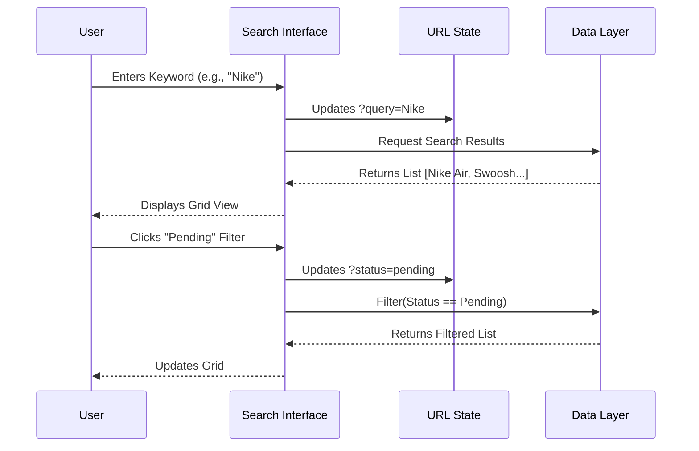
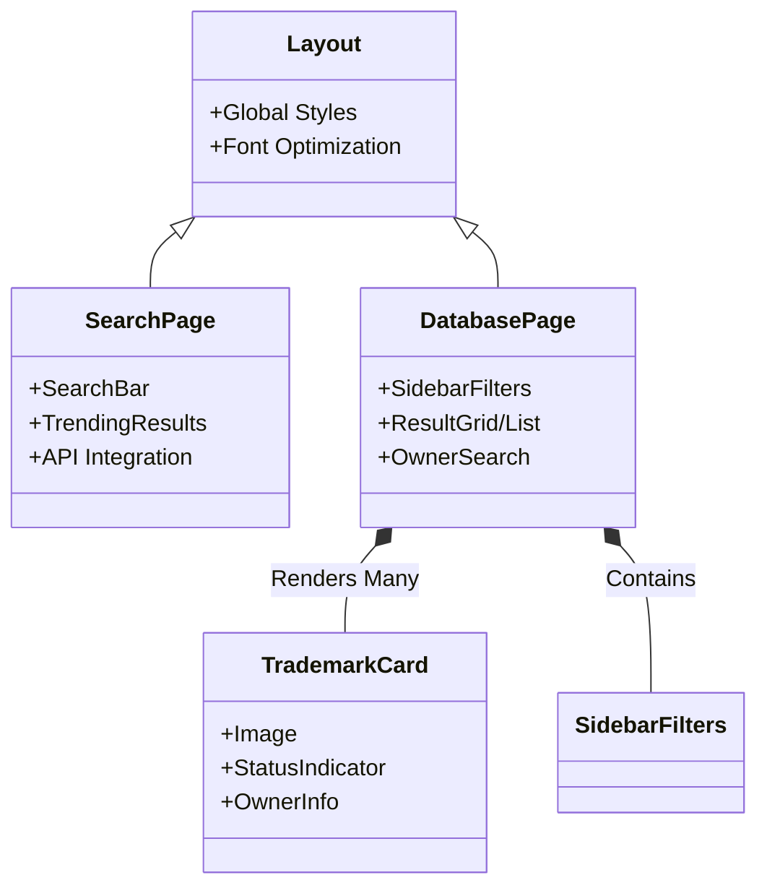

# Project Architecture & Design Overview

This document provides a visual and structural breakdown of the Trademarkia Search Application.

## 1. System Architecture
The application follows a modern usage of Next.js 15, leveraging Server Components and Client Components for optimal performance and interaction.

```mermaid
graph TD
    Client[User Browser]
    
    subgraph "Frontend Layer (Next.js)"
        Router[App Router]
        SearchPg[Search Page (Client)]
        DBPage[Database Page (Client)]
        API_Handler[API Service Layer]
    end
    
    subgraph "Data Layer"
        ExtAPI[Trademarkia External API]
        LocalDB[Local Mock DB]
    end

    Client -->|/search| Router
    Router --> SearchPg
    Client -->|/database?query=...| Router
    Router --> DBPage
    
    SearchPg -->|Async Request| API_Handler
    API_Handler -->|HTTP POST| ExtAPI
    
    DBPage -->|Filter/Sort| LocalDB
    DBPage -->|Read State| URL_Params[URL Search Params]
    URL_Params -->|Sync| DBPage
```

## 2. User Journey Flow
The core user experience revolves around searching, viewing results, and refining data.



## 3. Component Hierarchy
A breakdown of the key structural components and their relationships.



## 4. Key Data Models (TypeScript Interfaces)
The application relies on strict typing to ensure data consistency between the API and UI.

| Property | Type | Description |
| :--- | :--- | :--- |
| `id` / `serialNumber` | `string` | Unique identifier for the trademark. |
| `name` / `wordmark` | `string` | The text or name of the trademark. |
| `owner` | `string` | The legal entity owning the trademark. |
| `status` | `string` | Current legal status (e.g., Live, Dead, Pending). |
| `statusColor` | `string` | UI helper for visual indicators (green, yellow, red). |
| `classes` | `string[]` | Array of goods/services classes (e.g., Class 25). |

## 5. File System Structure
```mermaid
graph LR
    Root[src/app] --> Page[page.tsx (Landing)]
    Root --> Search[search/page.tsx]
    Root --> DB[database/]
    DB --> DBContent[DatabasePageContent.tsx]
    DB --> DBPage[page.tsx]
    
    style Root fill:#f9f,stroke:#333
    style Search fill:#bbf,stroke:#333
    style DBContent fill:#bfb,stroke:#333
```
